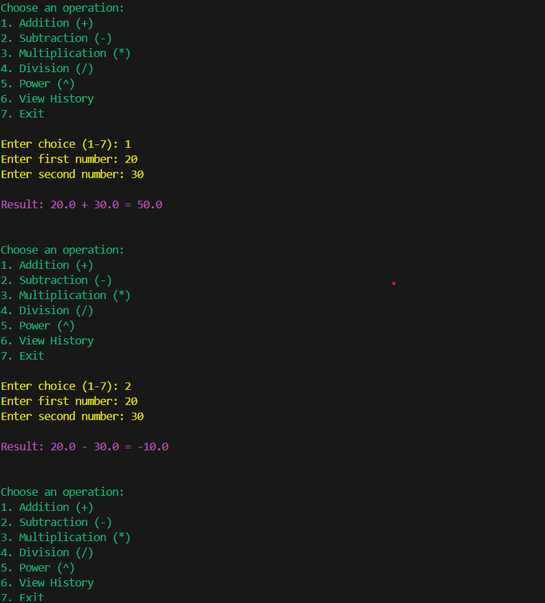
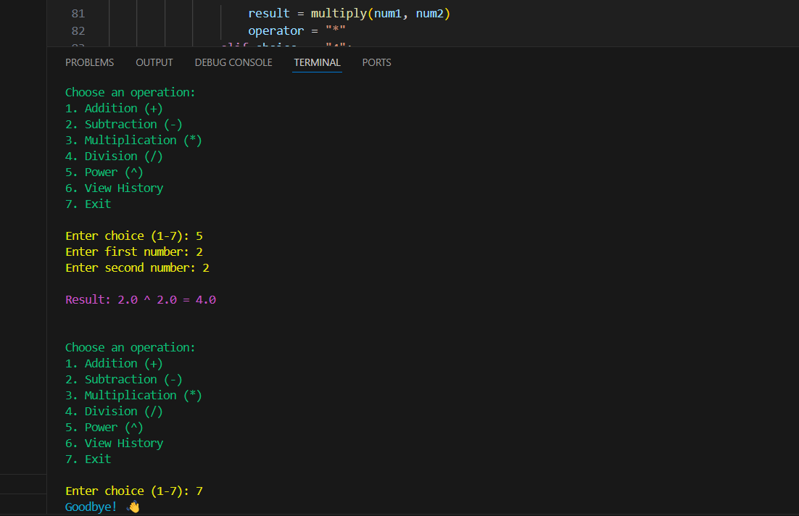

# 🎉 CLI Calculator (Python)

A colorful command-line calculator that supports basic arithmetic operations, power calculation, and keeps a history log of your calculations.

## ✨ Features
- Addition, subtraction, multiplication, division
- Exponentiation (power)
- View calculation history
- Colorful CLI interface with ASCII art
- Error handling (e.g., divide by zero)

## 📸 Screenshot




## 🚀 How to Run

1. Clone the repository:
```bash
git clone https://github.com/SangitaPatro/cli-calculator-python.git
cd cli-calculator-python
```

2. Install required libraries:
```bash
pip install colorama pyfiglet
```

3. Run the calculator:
```bash
python calculator.py
```
## 🧠 Code Explanation

- **calculator.py** is the main Python script.
- The calculator uses separate functions for each operation:
  - `add(x, y)`, `subtract(x, y)`, `multiply(x, y)`, `divide(x, y)`, and `power(x, y)`
- `log_history(entry)` saves each calculation to `calc_history.txt`
- `show_history()` displays the saved history from the text file
- The program runs in a loop (`while True`) and shows a colorful menu using `colorama` and ASCII art using `pyfiglet`
- User input is taken using `input()`, and the calculator keeps running until the user selects "Exit"
- Includes error handling (e.g., when dividing by zero or entering invalid input)
- I used two small Python libraries to make the calculator look nicer:
  - `colorama` → adds colored text in the terminal
  - `pyfiglet` → creates ASCII art title at the top
  
## 📂 Files
- `calculator.py`: main Python script
- `calc_history.txt`: auto-generated log file
- `README.md`: this file

Made by Sangita kankal

